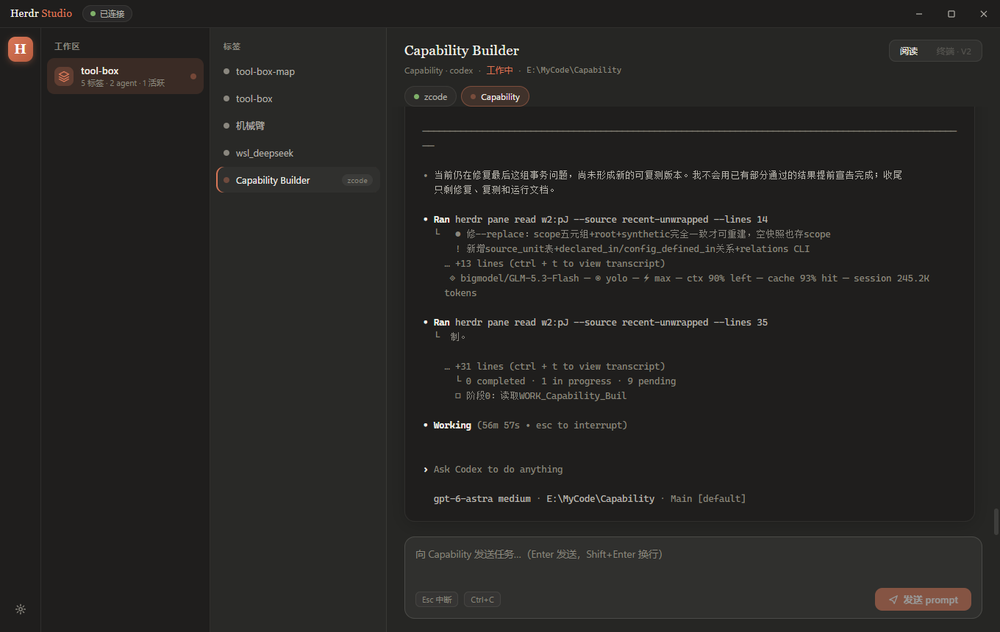

# Herdr Studio

基于 [herdr](https://github.com/nicobailon/herdr) server 的桌面驾驶舱应用 —— 在精致的图形界面里监督、阅读、驱动你的终端编码 agent。界面风格参考 Claude Code 桌面版（暖炭黑、赤陶橙、衬线标题、圆角卡片）。



## 它解决什么问题

herdr 的 TUI 在终端里运行，输出可读性受限。Herdr Studio 通过 herdr server 的
socket API 把同样的信息装进真正的桌面窗口：

- **实时看板**：工作区 / 标签 / 窗格 / agent（idle / working / blocked / done）全状态
- **阅读视图**：pane 输出以 ANSI 富文本渲染，等宽字体、自动跟随、可上翻回看
- **直接驱动**：向 agent 发 prompt、向 shell 发命令、Esc / Ctrl+C 中断
- **系统通知**：agent 变为 blocked / done 时弹 Windows 通知
- **实时推送**：`events.subscribe` 事件流驱动，非轮询

## 架构

```
Electron 主进程 (electron/)
├─ herdr-client.ts   管道发现 + JSON-RPC（每请求一条短连接）
│                    + events.subscribe 常驻事件流（断线指数退避重连）
├─ main.ts           窗口 / IPC / 双事件枢纽（全局状态 + 当前 pane 输出流）
└─ preload.ts        contextBridge 暴露类型化 API

React 渲染端 (src/)
├─ store.ts          zustand：snapshot 全量 + 事件增量归约 + 通知检测
├─ api.ts            类型化 herdr 方法封装
├─ ansi.tsx          anser 将 ANSI 输出转为带类名的 HTML
└─ components/       TitleBar / Rail / Sidebar / TabList / MainPane / Toasts
```

### 传输协议要点（逆向验证，适用于 herdr 0.8.0-preview / protocol 19）

- Windows：`%APPDATA%\herdr\herdr.sock` 是指针文件，真实端点是名为该文件
  完整路径的 named pipe：`\\.\pipe\C:\...\\herdr.sock`；POSIX 直接连接该路径。
- 按行分帧 JSON。请求 `{id, method, params}`，响应 `{id, result|error}`；
  **每条连接只处理一个请求**，`events.subscribe` 例外（常驻推流）。
- 读取源等枚举值在线上格式为下划线：`recent_unwrapped`（CLI 是连字符）。
- 事件推送信封为 `{"event": "...", "data": {...}}`。

## 开发

```bash
npm install
npm run dev        # vite + esbuild watch + electron 三进程并发
npm run typecheck  # 双 tsconfig 严格检查
npm run screenshot # 构建 + 无头截屏到 screenshots/（用于视觉回归）
```

## 打包

```bash
npm run dist       # electron-builder → NSIS 安装包 (win x64)
```

## 路线图

- **V2**：xterm.js 内嵌终端视图（「终端」页占位已预留，输出流接口已就绪）
- 布局编辑（split / move / resize 的 UI 暴露）
- 多 server / 命名会话切换
